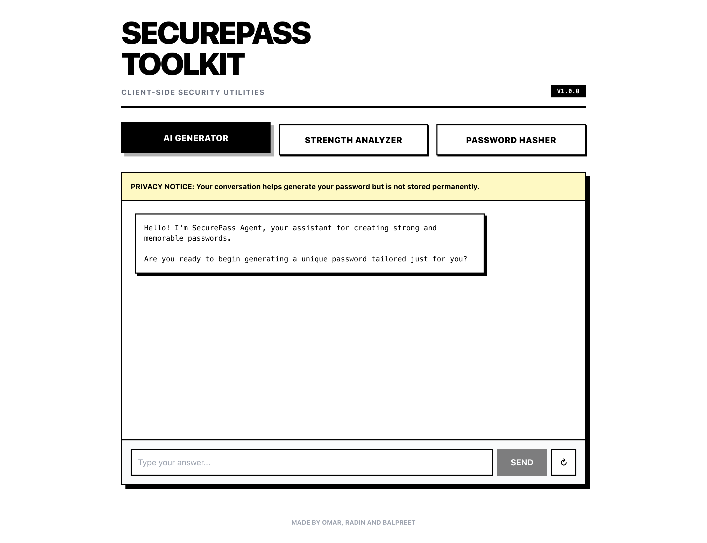
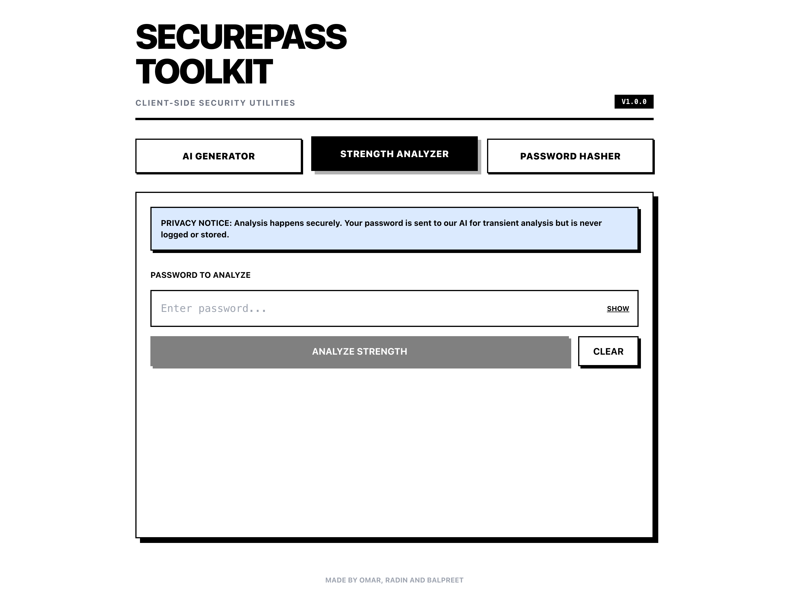
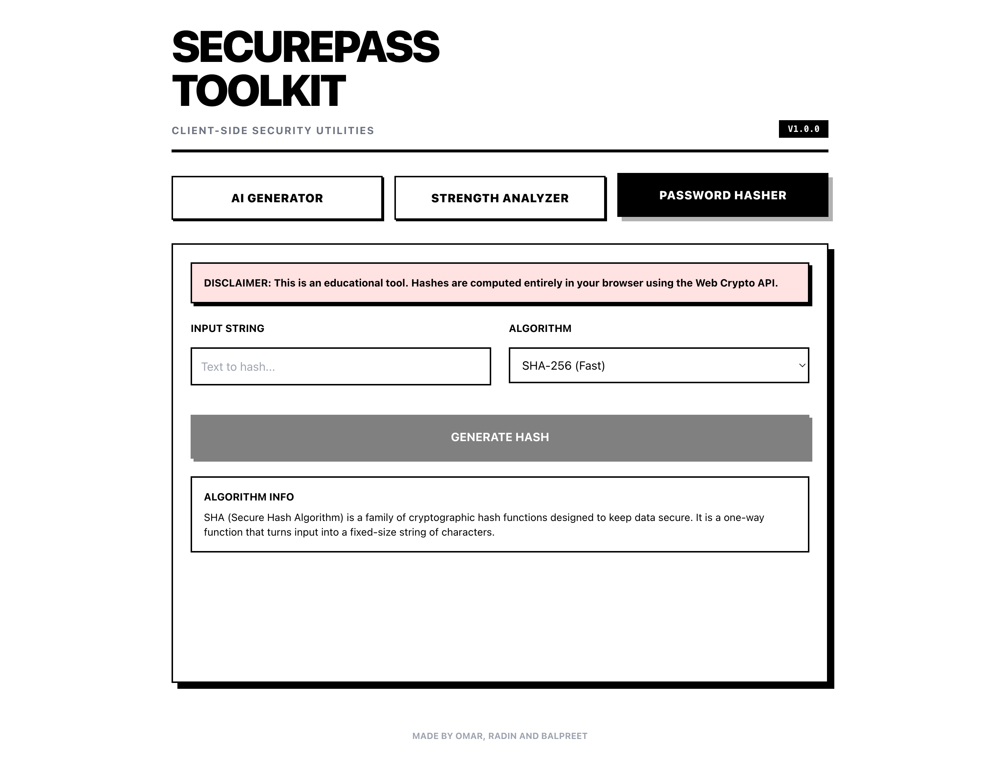

# SecurePass Toolkit

**SecurePass Toolkit** is a comprehensive suite of client-side security utilities designed to help users generate, analyze, and hash passwords securely. This application was built as a **final project for our Security Class**.

**Authors:** Omar, Radin, Balpreet

---

## 📸 Screenshots





---

## 🚀 Features

The toolkit consists of three main modules, each designed to address a specific aspect of password security:

### 1. 🤖 AI Password Generator
An interactive, chat-based tool that uses **Google Gemini AI** to create strong, memorable passwords.
- **Personalized**: Asks 3 distinct, creative questions to generate a password based on your personal associations.
- **Secure**: Ensures the final password is at least 12 characters long and includes a mix of uppercase, lowercase, numbers, and symbols.
- **Memorable**: Uses mnemonic techniques to make complex passwords easier to remember.

### 2. 🛡️ Strength Analyzer
A dual-engine password analysis tool that combines local cryptographic metrics with AI-powered insights.
- **Local Metrics**: Instantly calculates **Entropy** (in bits) and a **Strength Score** (0-5) entirely client-side.
- **AI Analysis**: Uses Google Gemini to provide:
  - **Crack Time Estimate**: Real-world estimation of how long it would take to brute-force the password.
  - **Qualitative Feedback**: Explains *why* the password is strong or weak.
  - **Vulnerability Detection**: Identifies specific weaknesses (e.g., common patterns, dictionary words).
- **Privacy Focused**: Passwords are analyzed transiently and are never logged or stored.

### 3. 🔑 Password Hasher
A browser-based hashing utility for educational and practical use.
- **Algorithms Supported**:
  - **SHA-256** (Fast, standard digest)
  - **SHA-512** (Stronger digest)
  - **PBKDF2** (Key derivation function, resistant to brute-force)
- **Advanced Options**:
  - Custom **Salt** generation (Hex).
  - Adjustable **Iterations** for PBKDF2 (default: 100,000).
- **Client-Side Only**: All hashing is performed using the browser's **Web Crypto API**.

---

## 🛠️ Technology Stack

- **Frontend**: React 19, TypeScript, Vite
- **Styling**: Tailwind CSS (via CDN), Custom CSS
- **AI Integration**: Google GenAI SDK (Gemini 2.5 Flash)
- **Cryptography**: Web Crypto API (Native Browser Standard)

---

## 📦 Installation & Setup

1. **Clone the repository**
   ```bash
   git clone <repository-url>
   cd securepass-toolkit
   ```

2. **Install dependencies**
   ```bash
   npm install
   ```

3. **Configure Environment**
   Create a `.env` file in the root directory and add your Google Gemini API key:
   ```env
   API_KEY=your_google_gemini_api_key
   ```

4. **Run the development server**
   ```bash
   npm run dev
   ```

5. **Build for production**
   ```bash
   npm run build
   ```

---

## 🔒 Security & Privacy

- **Client-Side Execution**: All hashing and local analysis happen entirely within your browser. No sensitive data is sent to a backend server.
- **AI Privacy**: When using the AI features, data is sent to Google's Gemini API for processing only. We explicitly instruct the model not to repeat passwords in its output.

---


